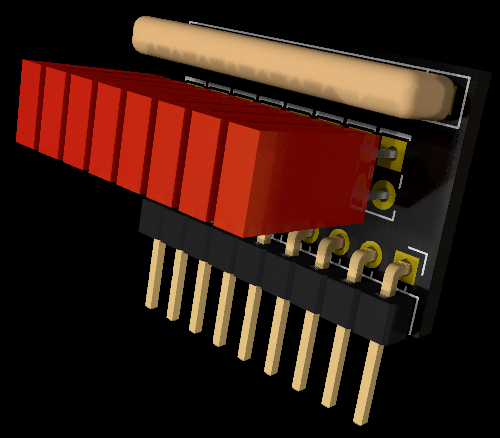
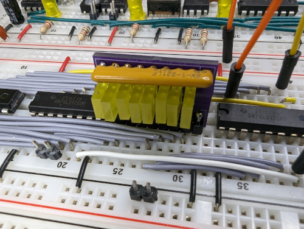

# Breadboard LED Array

I created these LED Arrays for use in my construction of the internet famous [Ben Eater 8-bit Computer](https://eater.net/8bit), but they could be handy for any breadboard project that requires groups of 8 LEDs.

The common ground pin is strategically placed so you can connect these directly to pins 2-9 (address lines) and pin 10 (ground) of a 74LS245 without any wires. The onboard resistor array limits the current to the LEDs so no external parts are needed.

This repository contains the KiCad 7 files for the circuit board. Also included are the gerber files if you want to fabricate your own boards. See the /fab folder.

Use this [parts list](https://www.mouser.com/ProjectManager/ProjectDetail.aspx?AccessID=65f5e81664) if you want to buy the LEDs and/or resistors from [mouser.com](https://mouser.com). These are not affiliate links.

[BreadboardLEDArray](https://github.com/SonOfSofaman/BreadboardLEDArray) � 2023 by [SofaTronics - SonOfSofaman](https://sofatronics.io/) is licensed under [CC BY-NC-SA 4.0](https://creativecommons.org/licenses/by-nc-sa/4.0/?ref=chooser-v1)
